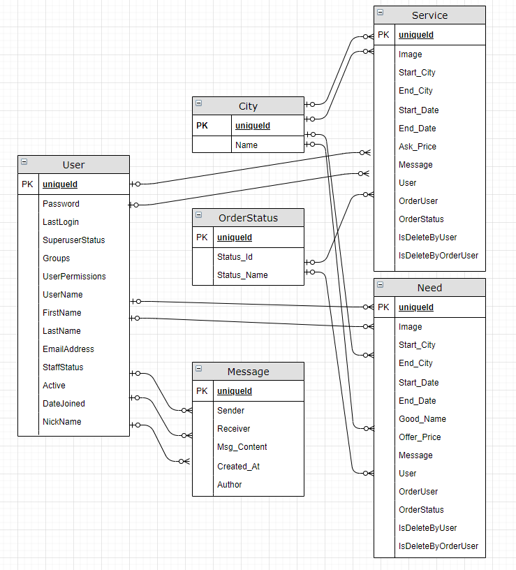

# 7420-Assessment

What transfergoods do?  

C2C platform provides the Postal services by individral, which committed to solving fast, small personal international and domestic express delivery needs.  

It provides general functions such as sign up, sign in, find lost password (through email), log out and change password.  

As it is a C2C platform, its main function allows users to create their own services and needs orders. Meanwhile, Users can also place services and needs orders when they need them. Thus, there are "My order" and "My publish" tabs to helps users find, track, edit and delete items.  

In purpose of allowing buyer and seller could communicate with each other, there is Message function. When user is interesting of one item, he can talk to item's owner directly. And the item's owner could find inbox message in "Inbox" tab and feedback the message, while user could track sent message in "Outbox" tab.  

How server-side rendering works?  
  `def index(request):
    orderstatus = OrderStatus.objects.get(status_name='published')
    allneeds = Need.objects.filter(orderstatus=orderstatus, isDeleteByUser=False)
    return render(request, 'index.html', context={'allneeds': allneeds})`
    
Define function, register router in url.py. Collecting model data by Model.objects.filter. Through return render() function, pass data to html file.
  
ERD:
  
  
 
